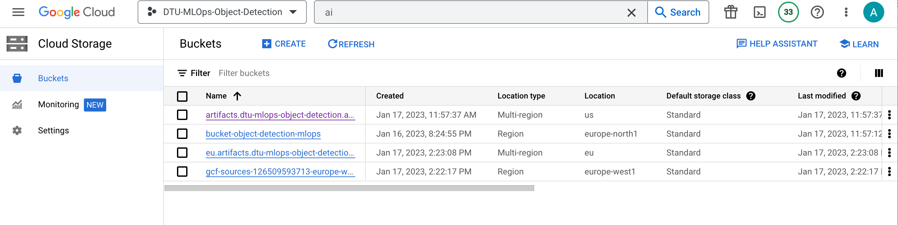
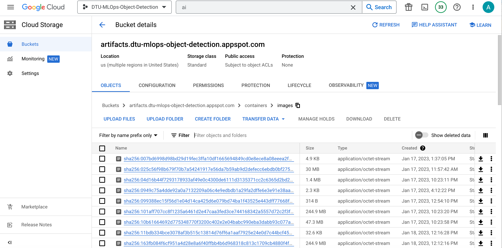
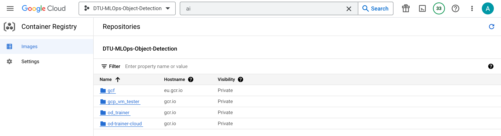
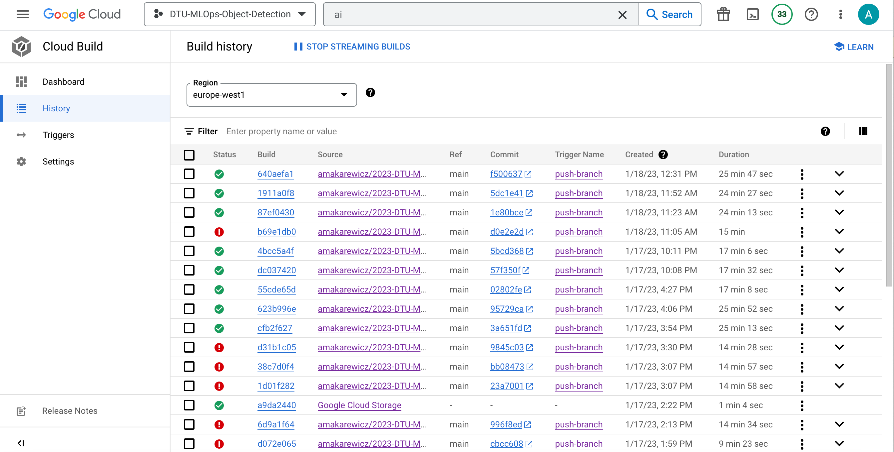

# Exam template for 02476 Machine Learning Operations

This is the report template for the exam. Please only remove the text formatted as with three dashes in front and behind
like:

```--- question 1 fill here ---```

where you instead should add your answers. Any other changes may have unwanted consequences when your report is auto
generated in the end of the course. For questions where you are asked to include images, start by adding the image to
the `figures` subfolder (please only use `.png`, `.jpg` or `.jpeg`) and then add the following code in your answer:

```markdown

```

In addition to this markdown file, we also provide the `report.py` script that provides two utility functions:

Running:

```bash
python report.py html
```

will generate an `.html` page of your report. After deadline for answering this template, we will autoscrape
everything in this `reports` folder and then use this utility to generate an `.html` page that will be your serve
as your final handin.

Running

```bash
python report.py check
```

will check your answers in this template against the constrains listed for each question e.g. is your answer too
short, too long, have you included an image when asked to.

For both functions to work it is important that you do not rename anything. The script have two dependencies that can
be installed with `pip install click markdown`.

## Overall project checklist

The checklist is *exhaustic* which means that it includes everything that you could possible do on the project in
relation the curricilum in this course. Therefore, we do not expect at all that you have checked of all boxes at the
end of the project.

### Week 1

* [x] Create a git repository
* [x] Make sure that all team members have write access to the github repository
* [x] Create a dedicated environment for you project to keep track of your packages
* [x] Create the initial file structure using cookiecutter
* [x] Fill out the `make_dataset.py` file such that it downloads whatever data you need and
* [x] Add a model file and a training script and get that running
* [ ] Remember to fill out the `requirements.txt` file with whatever dependencies that you are using
* [x] Remember to comply with good coding practices (`pep8`) while doing the project
* [x] Do a bit of code typing and remember to document essential parts of your code
* [x] Setup version control for your data or part of your data
* [x] Construct one or multiple docker files for your code
* [x] Build the docker files locally and make sure they work as intended
* [x] Write one or multiple configurations files for your experiments
* [x] Used Hydra to load the configurations and manage your hyperparameters
* [ ] When you have something that works somewhat, remember at some point to to some profiling and see if
      you can optimize your code
* [x] Use Weights & Biases to log training progress and other important metrics/artifacts in your code. Additionally, consider running a hyperparameter optimization sweep.
* [x] Use Pytorch-lightning (if applicable) to reduce the amount of boilerplate in your code

### Week 2

* [x] Write unit tests related to the data part of your code
* [ ] Write unit tests related to model construction and or model training
* [x] Calculate the coverage.
* [x] Get some continuous integration running on the github repository
* [x] Create a data storage in GCP Bucket for you data and preferable link this with your data version control setup
* [x] Create a trigger workflow for automatically building your docker images
* [x] Get your model training in GCP using either the Engine or Vertex AI
* [ ] Create a FastAPI application that can do inference using your model
* [ ] If applicable, consider deploying the model locally using torchserve
* [ ] Deploy your model in GCP using either Functions or Run as the backend

### Week 3

* [ ] Check how robust your model is towards data drifting
* [ ] Setup monitoring for the system telemetry of your deployed model
* [ ] Setup monitoring for the performance of your deployed model
* [ ] If applicable, play around with distributed data loading
* [ ] If applicable, play around with distributed model training
* [ ] Play around with quantization, compilation and pruning for you trained models to increase inference speed

### Additional

* [ ] Revisit your initial project description. Did the project turn out as you wanted?
* [x] Make sure all group members have a understanding about all parts of the project
* [x] Uploaded all your code to github

## Group information

### Question 1
> **Enter the group number you signed up on <learn.inside.dtu.dk>**
>
> Answer:

Group 25

### Question 2
> **Enter the study number for each member in the group**
>
> Answer:

s184303, s180857, s201773, s222678

### Question 3
> **What framework did you choose to work with and did it help you complete the project?**
>
> Answer length: 100-200 words.
>
> Example:
> *We used the third-party framework ... in our project. We used functionality ... and functionality ... from the*
> *package to do ... and ... in our project*.
>
> Answer:

We used the [Transformers](https://github.com/huggingface/transformers) framework from Huggingface in our project to perform object detection in images. We used the pretrained [DEtection TRansformer (DETR) model](https://huggingface.co/facebook/detr-resnet-50), which uses a CNN backbone to learn a 2D representation of input image.<br>

Furthermore, we used the dataset  [COCO 2017 dataset](https://cocodataset.org/#download) available through the torchvision module for both training and testing. The dataset consist of images which are annotated with class labels and maskes for each object.    


## Coding environment

> In the following section we are interested in learning more about you local development environment.

### Question 4

> **Explain how you managed dependencies in your project? Explain the process a new team member would have to go**
> **through to get an exact copy of your environment.**
>
> Answer length: 100-200 words

We used Conda to create a separate environment for managing our dependencies. The list of dependencies was auto-generated using the module `pipreqs`, through which a requirements.txt file was generated. To get a complete copy of our development environment, one would have to run the following commands `pip install -r requirements.txt` This is the initial and most simple way to secure reproducibility of the python part of the full model environment.<br>
Furthermore, to set up the correct system-level dependencies a new team member would need to build and succeedingly run the Docker image(s) created from the Dockerfiles contained in the project, i.e., running <br>
`docker build -f od_trainer.dockerfile . -t trainer:latest`<br>
`docker run --name od_trainer -v %cd%/models:/models/ trainer:latest`

### Question 5

> **We expect that you initialized your project using the cookiecutter template. Explain the overall structure of your**
> **code. Did you fill out every folder or only a subset?**
>
> Answer length: 100-200 words

We initilized our project with the cookicutter template. Most of the default scripts, such as `make_dataset.py`, `model.py`, `train_model.py`, `predict_model.py` etc. have been filled with code for this specific object detection in images-project. Furthermore we have added content to the test scripts which are also set up by default for unit testing. We have mainly followed the pre-created content- and folder structure (src/, report/, notebooks/, etc.), and added additional folders if necessary or convenient. As an example we have created a config folder that keeps track of configuration files for different parts of the project with a default_config.yaml pointing to the task-dependent config files, e.g. predict_config.yaml for prediction reproducability. Furthermore we have updated the requirements.txt to match the required Python environment.<br> We have also added a .dvc folder and additionally dvc file for the storage in dvc. These were both generated automatically when setting up the data version control for the project using dvc with google drive and cloud. 


### Question 6

> **Did you implement any rules for code quality and format? Additionally, explain with your own words why these**
> **concepts matters in larger projects.**
>
> Answer length: 50-100 words.
>
To insure code quality we have implemented the module `Flake8`. It is a tool that helps to ensure the same code style throughout the project by providing overview of sections where the code does not seems to be following the style and rules suggested by Pep8 (the official style guide for python).<br>
To a large extend we have also made use of *Typing*, however it's has not been a priority to strickly make sure its present in all our created functions. The use of both typing and docstrings have been a usefull guide to the team, since it easily can become confusing to remember the required insput and uses of the various functions that are develop throghout the project.

## Version control

> In the following section we are interested in how version control was used in your project during development to
> corporate and increase the quality of your code.

### Question 7

> **How many tests did you implement and what are they testing in your code?**
>
> Answer length: 50-100 words.
>
> Example:
> *In total we have implemented X tests. Primarily we are testing ... and ... as these the most critical parts of our*
> *application but also ... .*
>
> Answer:

We have implemented tests for data, training and modelling. For the data we test for **x,y,z…..** In total we have implemented X tests. 

### Question 8

> **What is the total code coverage (in percentage) of your code? If you code had an code coverage of 100% (or close**
> **to), would you still trust it to be error free? Explain you reasoning.**
>
> Answer length: 100-200 words.
>
> Answer:

The total code coverage of code is **X %**. The coverage-metric is based on to what extend all functions in the model are called in the test functions. Even if we had 100 % code coverage, i.e. all functions are called at least one time during project testing, we would still not be able to completely trust the code. The reason this is not bullet-proof is that you may not cover all possible error types even though the function is used in a test and some unintended input/output errors may go undiscovered because you test for something else. It is a tedious and almost impossible task to test for everything in every part of the code. But having a high test coverage at least indicates that some consideration about possible errors is tested for. 

### Question 9

> **Did you workflow include using branches and pull requests? If yes, explain how. If not, explain how branches and**
> **pull request can help improve version control.**
>
> Answer length: 100-200 words.
>
The workflow has been highly dependend on version control using git. We used branches to version control different components of the code, which eased the process in collaborating and editing simultaneously. We used the branches to represent a component in the code rather than different team members' work. This was the preferred workflow since multiple members often contributed in a single component and it was easier to track changes in certain functionalities. We used pull request to merge amended/added code of a (new) component in to the main branch and make sure everything were able to run smoothly by reviewing each others code before merging.

### Question 10

> **Did you use DVC for managing data in your project? If yes, then how did it improve your project to have version**
> **control of your data. If no, explain a case where it would be beneficial to have version control of your data.**
>
> Answer length: 100-200 words.
>
> Example:
> *We did make use of DVC in the following way: ... . In the end it helped us in ... for controlling ... part of our*
> *pipeline*
>
> Answer:

We used DVC for version control of our data. Furthermore we also made use of google cloud storage for our data. In the end we did not have multiple versions of data and did therefore not use the version control that much, but we were able to set it up for further usage. <br>
DVC and cloud storage is both beneficial for version contral and in projects where data is transformed and storage in different formates it is useful to have the version contral set up. 


### Question 11

> **Discuss your continuous integration setup. What kind of CI are you running (unittesting, linting, etc.)? Do you test**
> **multiple operating systems, python version etc. Do you make use of caching? Feel free to insert a link to one of**
> **your github actions workflow.**
>
> Answer length: 200-300 words.
>
> Example:
> *We have organized our CI into 3 separate files: one for doing ..., one for running ... testing and one for running*
> *... . In particular for our ..., we used ... .An example of a triggered workflow can be seen here: <weblink>*
>
> Answer:

--- question 11 fill here ---

## Running code and tracking experiments

> In the following section we are interested in learning more about the experimental setup for running your code and
> especially the reproducibility of your experiments.

### Question 12

> **How did you configure experiments? Did you make use of config files? Explain with coding examples of how you would**
> **run a experiment.**
>
> Answer length: 50-100 words.
>
We have used the Hydra tool in order to load the relevant configurations for both our python scripts and experiments. 
Through the configuration files one can easily manage and run a desired version/experiment. Our config files can be used for choosing a specific data set and moreover reproducing an experiment by ensuring the exact same hyperparameters are used.

***Command for running a potential other experiment***<br>


### Question 13

> **Reproducibility of experiments are important. Related to the last question, how did you secure that no information**
> **is lost when running experiments and that your experiments are reproducible?**
>
> Answer length: 100-200 words.
>
> Example:
> *We made use of config files. Whenever an experiment is run the following happens: ... . To reproduce an experiment*
> *one would have to do ...*
>
> Answer:

--- question 13 fill here ---

### Question 14

> **Upload 1 to 3 screenshots that show the experiments that you have done in W&B (or another experiment tracking**
> **service of your choice). This may include loss graphs, logged images, hyperparameter sweeps etc. You can take**
> **inspiration from [this figure](figures/wandb.png). Explain what metrics you are tracking and why they are**
> **important.**
>
> Answer length: 200-300 words + 1 to 3 screenshots.
>
> Example:
> *As seen in the first image when have tracked ... and ... which both inform us about ... in our experiments.*
> *As seen in the second image we are also tracking ... and ...*
>
> Answer:

--- question 14 fill here ---

### Question 15

> **Docker is an important tool for creating containerized applications. Explain how you used docker in your**
> **experiments? Include how you would run your docker images and include a link to one of your docker files.**
>
> Answer length: 100-200 words.
>
> Example:
> *For our project we developed several images: one for training, inference and deployment. For example to run the*
> *training docker image: `docker run trainer:latest lr=1e-3 batch_size=64`. Link to docker file: <weblink>*
>
> Answer:

We have created two docker files for our project, one for training and one for predicting.   

### Question 16

> **When running into bugs while trying to run your experiments, how did you perform debugging? Additionally, did you**
> **try to profile your code or do you think it is already perfect?**
>
> Answer length: 100-200 words.
>
> Example:
> *Debugging method was dependent on group member. Some just used ... and others used ... . We did a single profiling*
> *run of our main code at some point that showed ...*
>
> Answer:

--- question 16 fill here ---

## Working in the cloud

> In the following section we would like to know more about your experience when developing in the cloud.

### Question 17

> **List all the GCP services that you made use of in your project and shortly explain what each service does?**
>
> Answer length: 50-200 words.
>
> Example:
> *We used the following two services: Engine and Bucket. Engine is used for... and Bucket is used for...*
>
> Answer:

We used the following five services on the google cloud platform: Cloud Storage(Bucket), Compute Engine, Cloud Build(Triggers), Container Registy and Vertex AI.<br>
Vertex AI is used for training the model. Vertex AI creates a VM and use the training docker image to train the model. The docker images is stored in the Container Registy and the images is uploaded to the cloud by the Cloud Build Triggers.<br>
Furthermore the data is stored in a Bucket in Cloud Storage. In the beginning we started by using Computer Engine and created VM, but later on we used Vertex AI to create the VM. 


### Question 18

> **The backbone of GCP is the Compute engine. Explained how you made use of this service and what type of VMs**
> **you used?**
>
> Answer length: 100-200 words.
>
> Example:
> *We used the compute engine to run our ... . We used instances with the following hardware: ... and we started the*
> *using a custom container: ...*
>
> Answer:

--- question 18 fill here ---

### Question 19

> **Insert 1-2 images of your GCP bucket, such that we can see what data you have stored in it.**
> **You can take inspiration from [this figure](figures/bucket.png).**
>
> Answer:





### Question 20

> **Upload one image of your GCP container registry, such that we can see the different images that you have stored.**
> **You can take inspiration from [this figure](figures/registry.png).**
>
> Answer:



### Question 21

> **Upload one image of your GCP cloud build history, so we can see the history of the images that have been build in**
> **your project. You can take inspiration from [this figure](figures/build.png).**
>
> Answer:



### Question 22

> **Did you manage to deploy your model, either in locally or cloud? If not, describe why. If yes, describe how and**
> **preferably how you invoke your deployed service?**
>
> Answer length: 100-200 words.
>
> Example:
> *For deployment we wrapped our model into application using ... . We first tried locally serving the model, which*
> *worked. Afterwards we deployed it in the cloud, using ... . To invoke the service an user would call*
> *`curl -X POST -F "file=@file.json"<weburl>`*
>
> Answer:

--- question 22 fill here ---

### Question 23

> **Did you manage to implement monitoring of your deployed model? If yes, explain how it works. If not, explain how**
> **monitoring would help the longevity of your application.**
>
> Answer length: 100-200 words.
>
> Example:
> *We did not manage to implement monitoring. We would like to have monitoring implemented such that over time we could*
> *measure ... and ... that would inform us about this ... behaviour of our application.*
>
> Answer:

--- question 23 fill here ---

### Question 24

> **How many credits did you end up using during the project and what service was most expensive?**
>
> Answer length: 25-100 words.
>
> Example:
> *Group member 1 used ..., Group member 2 used ..., in total ... credits was spend during development. The service*
> *costing the most was ... due to ...*
>
> Answer:

--- question 24 fill here ---

## Overall discussion of project

> In the following section we would like you to think about the general structure of your project.

### Question 25

> **Include a figure that describes the overall architecture of your system and what services that you make use of.**
> **You can take inspiration from [this figure](figures/overview.png). Additionally in your own words, explain the**
> **overall steps in figure.**
>
> Answer length: 200-400 words
>
> Example:
>
> *The starting point of the diagram is our local setup, where we integrated ... and ... and ... into our code.*
> *Whenever we commit code and puch to github, it auto triggers ... and ... . From there the diagram shows ...*
>
> Answer:

--- question 25 fill here ---

### Question 26

> **Discuss the overall struggles of the project. Where did you spend most time and what did you do to overcome these**
> **challenges?**
>
> Answer length: 200-400 words.
>
> Example:
> *The biggest challenges in the project was using ... tool to do ... . The reason for this was ...*
>
> Answer:

First of all we spend multiple days on retrieving the data and making it fit our model.<br>
**\*\*\*….**<br>
We also spend a lot of time on the FastAPI to make it work, or the FastAPI was easy enough but it took us a long time making the predict model output fit into the FastAPI. 


### Question 27

> **State the individual contributions of each team member. This is required information from DTU, because we need to**
> **make sure all members contributed actively to the project**
>
> Answer length: 50-200 words.
Student s180857 and s201773 was in charge of setting up the cookiecutter project wereas s222678 was in charge of writing the initial project description. In the process of retrieving the data s222678 was in charge of the coco dataset and s180857 retrieved the voc dataset. For training and prediction s201773 together with s222678 was in charge of the modelling and furthermore s201773 did the visualization. s180857 did the initial development of the docker container, modified by other team members afterwards. Student s184303 set up the google cloud platform and the W&B and together with s180857, s184303 did the unittesting, CI  and wrote documentation including this project report. s201773 and s222678 managed to modify the code to train the model in the cloud. All team members has contributed to the code and together the group has modified and improved the code a long the way to make this project.
