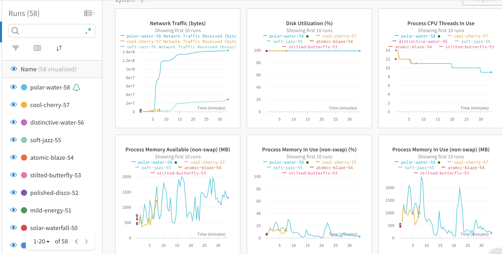
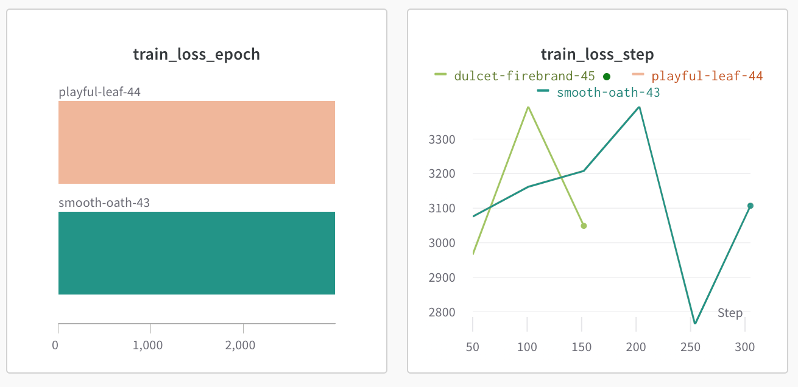
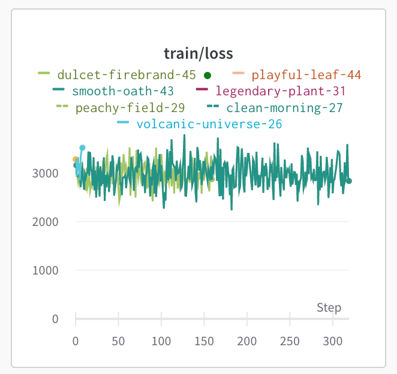
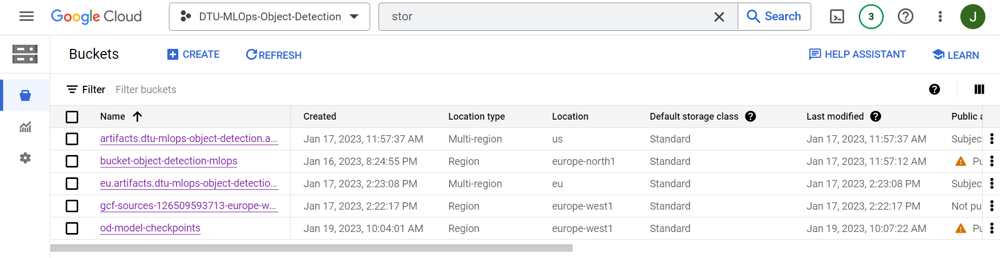
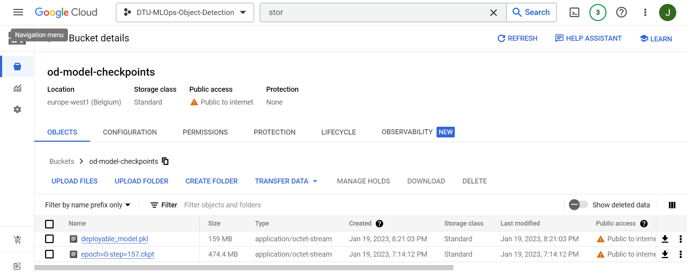
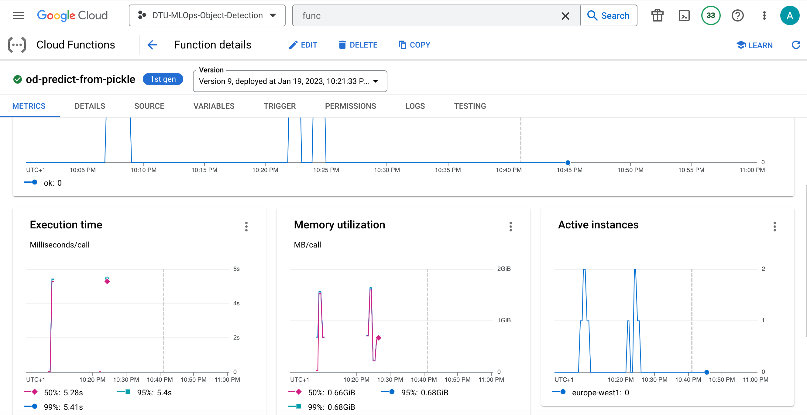
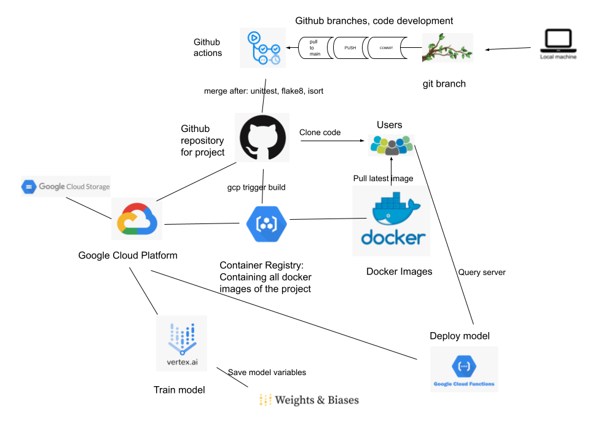

# Exam template for 02476 Machine Learning Operations

This is the report template for the exam. Please only remove the text formatted as with three dashes in front and behind
like:

```--- question 1 fill here ---```

where you instead should add your answers. Any other changes may have unwanted consequences when your report is auto
generated in the end of the course. For questions where you are asked to include images, start by adding the image to
the `figures` subfolder (please only use `.png`, `.jpg` or `.jpeg`) and then add the following code in your answer:

```markdown

```

In addition to this markdown file, we also provide the `report.py` script that provides two utility functions:

Running:

```bash
python report.py html
```

will generate an `.html` page of your report. After deadline for answering this template, we will autoscrape
everything in this `reports` folder and then use this utility to generate an `.html` page that will be your serve
as your final handin.

Running

```bash
python report.py check
```

will check your answers in this template against the constrains listed for each question e.g. is your answer too
short, too long, have you included an image when asked to.

For both functions to work it is important that you do not rename anything. The script have two dependencies that can
be installed with `pip install click markdown`.

## Overall project checklist

The checklist is *exhaustic* which means that it includes everything that you could possible do on the project in
relation the curricilum in this course. Therefore, we do not expect at all that you have checked of all boxes at the
end of the project.

### Week 1

* [x] Create a git repository
* [x] Make sure that all team members have write access to the github repository
* [x] Create a dedicated environment for you project to keep track of your packages
* [x] Create the initial file structure using cookiecutter
* [x] Fill out the `make_dataset.py` file such that it downloads whatever data you need and
* [x] Add a model file and a training script and get that running
* [x] Remember to fill out the `requirements.txt` file with whatever dependencies that you are using
* [x] Remember to comply with good coding practices (`pep8`) while doing the project
* [x] Do a bit of code typing and remember to document essential parts of your code
* [x] Setup version control for your data or part of your data
* [x] Construct one or multiple docker files for your code
* [x] Build the docker files locally and make sure they work as intended
* [x] Write one or multiple configurations files for your experiments
* [x] Used Hydra to load the configurations and manage your hyperparameters
* [ ] When you have something that works somewhat, remember at some point to to some profiling and see if
      you can optimize your code
* [x] Use Weights & Biases to log training progress and other important metrics/artifacts in your code. Additionally, consider running a hyperparameter optimization sweep.
* [x] Use Pytorch-lightning (if applicable) to reduce the amount of boilerplate in your code

### Week 2

* [x] Write unit tests related to the data part of your code
* [ ] Write unit tests related to model construction and or model training
* [x] Calculate the coverage.
* [x] Get some continuous integration running on the github repository
* [x] Create a data storage in GCP Bucket for you data and preferable link this with your data version control setup
* [x] Create a trigger workflow for automatically building your docker images
* [x] Get your model training in GCP using either the Engine or Vertex AI
* [ ] Create a FastAPI application that can do inference using your model
* [ ] If applicable, consider deploying the model locally using torchserve
* [ ] Deploy your model in GCP using either Functions or Run as the backend

### Week 3

* [ ] Check how robust your model is towards data drifting
* [ ] Setup monitoring for the system telemetry of your deployed model
* [ ] Setup monitoring for the performance of your deployed model
* [ ] If applicable, play around with distributed data loading
* [ ] If applicable, play around with distributed model training
* [ ] Play around with quantization, compilation and pruning for you trained models to increase inference speed

### Additional

* [ ] Revisit your initial project description. Did the project turn out as you wanted?
* [x] Make sure all group members have a understanding about all parts of the project
* [x] Uploaded all your code to github

## Group information

### Question 1
> **Enter the group number you signed up on <learn.inside.dtu.dk>**
>
> Answer:

Group 25

### Question 2
> **Enter the study number for each member in the group**
>
> Answer:

s184303, s180857, s201773, s222678

### Question 3
> **What framework did you choose to work with and did it help you complete the project?**
>
> Answer length: 100-200 words.
>
> Example:
> *We used the third-party framework ... in our project. We used functionality ... and functionality ... from the*
> *package to do ... and ... in our project*.
>
> Answer:

We used the [Transformers](https://github.com/huggingface/transformers) framework from Huggingface in our project to perform object detection in images. We used the pretrained [DEtection TRansformer (DETR) model](https://huggingface.co/facebook/detr-resnet-50), which uses a CNN backbone to learn a 2D representation of input image.<br>

Furthermore, we used the dataset  [COCO 2017 dataset](https://cocodataset.org/#download) available through the torchvision module for both training and testing. The dataset consist of images which are annotated with class labels and maskes for each object. We also used another dataset, [VOC](https://public.roboflow.com/object-detection/pascal-voc-2012), for additional experiments on the model and it's performance.  


## Coding environment

> In the following section we are interested in learning more about you local development environment.

### Question 4

> **Explain how you managed dependencies in your project? Explain the process a new team member would have to go**
> **through to get an exact copy of your environment.**
>
> Answer length: 100-200 words

We used Conda to create a separate environment for managing our dependencies. The list of dependencies was auto-generated using the module `pipreqs`, through which a requirements.txt file was generated. To get a complete copy of our development environment, one would have to run the following commands `pip install -r requirements.txt` This is the initial and most simple way to secure reproducibility of the python part of the full model environment.<br>
Furthermore, to set up the correct system-level dependencies a new team member would need to build and succeedingly run the Docker image(s) created from the Dockerfiles contained in the project, i.e., running <br>
`docker build -f od_trainer.dockerfile . -t trainer:latest`<br>
`docker run --name od_trainer -v %cd%/models:/models/ trainer:latest`

### Question 5

> **We expect that you initialized your project using the cookiecutter template. Explain the overall structure of your**
> **code. Did you fill out every folder or only a subset?**
>
> Answer length: 100-200 words
>
>

We initilized our project with the cookicutter template. Most of the default scripts, such as `make_dataset.py`, `model.py`, `train_model.py`, `predict_model.py` etc. have been filled with code for this specific object detection in images-project. Furthermore we have added content to the test scripts which are also set up by default for unit testing. We have mainly followed the pre-created content- and folder structure (src/, report/, notebooks/, etc.), and added additional folders if necessary or convenient. As an example we have created a config folder that keeps track of configuration files for different parts of the project with a default_config.yaml pointing to the task-dependent config files, e.g. predict_config.yaml for prediction reproducability. Furthermore we have updated the requirements.txt to match the required Python environment.<br> We have also added a .dvc folder and additionally dvc file for the storage in dvc. These were both generated automatically when setting up the data version control for the project using dvc with google drive and cloud. 


### Question 6

> **Did you implement any rules for code quality and format? Additionally, explain with your own words why these**
> **concepts matters in larger projects.**
>
> Answer length: 50-100 words.
>
To insure code quality we have implemented `Flake8`. It is a tool that helps to ensure the same code style throughout the project by providing overview of sections where the code does not seems to be following the style and rules suggested by Pep8. Github actions has also been used to unsure good code quality, two workflows has been made for flake8 and isort. 


## Version control

> In the following section we are interested in how version control was used in your project during development to
> corporate and increase the quality of your code.

### Question 7

> **How many tests did you implement and what are they testing in your code?**
>
> Answer length: 50-100 words.
>
> Example:
> *In total we have implemented X tests. Primarily we are testing ... and ... as these the most critical parts of our*
> *application but also ... .*
>
> Answer:

We have implemented tests for data and code structure. For the data we test the shape of the dataloader batch to make sure it has the correct shape. We have included a skipif so the data test is skiped of the data folder does not have any data. We also test pep8 and isort corectness of our code. In total we implemented 3 tests.

### Question 8

> **What is the total code coverage (in percentage) of your code? If you code had an code coverage of 100% (or close**
> **to), would you still trust it to be error free? Explain you reasoning.**
>
> Answer length: 100-200 words.
>
> Answer:

The total code coverage of code in the test is 62 % for the data test and 0 % for the model, since we did not have the time to implement test of model as well. The coverage-metric is based on to what extend all functions in the model are called in the test functions. Even if we had 100 % code coverage, i.e. all functions are called at least one time during project testing, we would still not be able to completely trust the code. The reason this is not bullet-proof is that you may not cover all possible error types even though the function is used in a test and some unintended input/output errors may go undiscovered because you test for something else. It is a tedious and almost impossible task to test for everything in every part of the code. But having a high test coverage at least indicates that some consideration about possible errors is tested for. 

### Question 9

> **Did you workflow include using branches and pull requests? If yes, explain how. If not, explain how branches and**
> **pull request can help improve version control.**
>
> Answer length: 100-200 words.
>
The workflow has been highly dependend on version control using git. We used branches to version control different components of the code, which eased the process in collaborating and editing simultaneously. We used the branches to represent a component in the code rather than different team members' work. This was the preferred workflow since multiple members often contributed in a single component and it was easier to track changes in certain functionalities. We used pull request to merge amended/added code of a (new) component in to the main branch and make sure everything were able to run smoothly by reviewing each others code before merging.

### Question 10

> **Did you use DVC for managing data in your project? If yes, then how did it improve your project to have version**
> **control of your data. If no, explain a case where it would be beneficial to have version control of your data.**
>
> Answer length: 100-200 words.
>
> Example:
> *We did make use of DVC in the following way: ... . In the end it helped us in ... for controlling ... part of our*
> *pipeline*
>
> Answer:

We used DVC for version control of our data. Furthermore we also made use of google cloud storage for our data. In the end we did not have multiple versions of data and did therefore not use the DVC version control that much, but we were able to set it up for further usage. We also tested that it worked smoothly in case it was needed further on. <br>
DVC and cloud storage is both beneficial for version contral and in projects where data is transformed and storage into different formates it is useful to have the version contral set up. Version control also gives the possibility to go back if any changes should be changed back later on. 


### Question 11

> **Discuss your continuous integration setup. What kind of CI are you running (unittesting, linting, etc.)? Do you test**
> **multiple operating systems, python version etc. Do you make use of caching? Feel free to insert a link to one of**
> **your github actions workflow.**
>
> Answer length: 200-300 words.
>
> Example:
> *We have organized our CI into 3 separate files: one for doing ..., one for running ... testing and one for running*
> *... . In particular for our ..., we used ... .An example of a triggered workflow can be seen here: <weblink>*
>
> Answer:

We have organized our continous integration into three separate files, one for testing the setup with isort. Isort makes sure the imports are sorted correctly in the code. We have also created one file for testing good code quality with flake8. Flake8 uses pep8 for checking the codestyle and pyflakes for checking syntex. And last but not least we have one continous integration file for running our self created tests of the code to provent possible errors with the data, model and training. The three workflows can be seen under our git actions. For our testing of data that is stored inside dvc we used secret actions to connect to dvc. Due to the large amount of data the test workflows takes some time to run. The three actions is activated on push and pull requests on the main branch. They set up python version and dependencies from requirements.txt and additional requirements_test.txt. The workflows has been triggered multiple times due to the uses of branches in the project. The main focus has been on the model and implementation, and therefore not  on fiksing code style and so on, but as a further work possibility and for improving the code, we would like to adjust everything to pep8 when we have more time. 

## Running code and tracking experiments

> In the following section we are interested in learning more about the experimental setup for running your code and
> especially the reproducibility of your experiments.

### Question 12

> **How did you configure experiments? Did you make use of config files? Explain with coding examples of how you would**
> **run a experiment.**
>
> Answer length: 50-100 words.
>
We have used the Hydra tool in order to load the relevant configurations for both our python scripts and experiments. 
Through the configuration files one can easily manage and run a desired version/experiment. Our config files can be used for choosing a specific data set and moreover reproducing an experiment by ensuring the exact same hyperparameters are used.


### Question 13

> **Reproducibility of experiments are important. Related to the last question, how did you secure that no information**
> **is lost when running experiments and that your experiments are reproducible?**
>
> Answer length: 100-200 words.
>
> Example:
> *We made use of config files. Whenever an experiment is run the following happens: ... . To reproduce an experiment*
> *one would have to do ...*
>
> Answer:

We made use of config files as already explained in the privious question. To reproduce an experiment it would be esential to run with the same hyperparameters which in this project is saved in config files. If multiple experiments were to be made, multiple config files with hyperparameters for each experiment would have to be saved and documented for future reproducerbility. Furthermore reproducing results would require same environment which is ensured in the requirement.txt file and through the docker images. Multiple docker images has been created for different tasks. One docker images has been created for training and another for prdiction.   

### Question 14

> **Upload 1 to 3 screenshots that show the experiments that you have done in W&B (or another experiment tracking**
> **service of your choice). This may include loss graphs, logged images, hyperparameter sweeps etc. You can take**
> **inspiration from [this figure](figures/wandb.png). Explain what metrics you are tracking and why they are**
> **important.**
>
> Answer length: 200-300 words + 1 to 3 screenshots.
>
> Example:
> *As seen in the first image when have tracked ... and ... which both inform us about ... in our experiments.*
> *As seen in the second image we are also tracking ... and ...*
>
> Answer:

As seen in the image multiple experience has been run on the training of the model. Some of the tracked runs has been initial testing of the model to further improve the code of the model. Some of the short runs is trainings that has been stoped due to local capasity and the time of training locally. The runs that has performed the best and run the longest is the cloud experiments of the model due to the use of VM. 

The last picture shows that the loss does not change much ower time. This could very well be due to the fact that we are training a pre trained model on the same data as it was alreasdy trained on. To further improve the model we would (in case we had more time) train the model on a new data set. 







### Question 15

> **Docker is an important tool for creating containerized applications. Explain how you used docker in your**
> **experiments? Include how you would run your docker images and include a link to one of your docker files.**
>
> Answer length: 100-200 words.
>
> Example:
> *For our project we developed several images: one for training, inference and deployment. For example to run the*
> *training docker image: `docker run trainer:latest lr=1e-3 batch_size=64`. Link to docker file: <weblink>*
>
> Answer:

Wa have created a docker file to train our model in a cloud environment. The docker sets up the software needed for training and runs the train_model.py script. Docker container is created in Container Registry, thanks to the trigger, every time we push changes to the main branch in git repository. Then we manually run a vertex AI trainning using config_cpu/gpu.yaml configuration files, and already built container.

### Question 16

> **When running into bugs while trying to run your experiments, how did you perform debugging? Additionally, did you**
> **try to profile your code or do you think it is already perfect?**
>
> Answer length: 100-200 words.
>
> Example:
> *Debugging method was dependent on group member. Some just used ... and others used ... . We did a single profiling*
> *run of our main code at some point that showed ...*
>
> Answer:

When training the model and using it for prediction we ran into some challenges including bugs and other errors. Also in the process of retriving the data, we had some bugs to solve. We asolve the problems by detecting the code, printing 

## Working in the cloud

> In the following section we would like to know more about your experience when developing in the cloud.

### Question 17

> **List all the GCP services that you made use of in your project and shortly explain what each service does?**
>
> Answer length: 50-200 words.
>
> Example:
> *We used the following two services: Engine and Bucket. Engine is used for... and Bucket is used for...*
>
> Answer:

We used the following five services on the google cloud platform: Cloud Storage(Bucket), Cloud Build(Triggers), Container Registy, Vertex AI and Cloud Functions.<br><br>
We used Cloud Build to automate creating docker containers in the cloud. Then we save the containers in a Container Registry. We use created containers to train the model with Vertex AI jobs. Trained models are saved in the Cloud Storage Bucket. Finally we deploy the model using Cloud Functions.

### Question 18

> **The backbone of GCP is the Compute engine. Explained how you made use of this service and what type of VMs**
> **you used?**
>
> Answer length: 100-200 words.
>
> Example:
> *We used the compute engine to run our ... . We used instances with the following hardware: ... and we started the*
> *using a custom container: ...*
>
> Answer:

We use cloud engines when we run Vertex AI trainning. Due to large size of the model, we decided to use high memory engine - n1-highmem-16 which has 16 CPUs and 104 GB memory.

### Question 19

> **Insert 1-2 images of your GCP bucket, such that we can see what data you have stored in it.**
> **You can take inspiration from [this figure](figures/bucket.png).**
>
> Answer:





### Question 20

> **Upload one image of your GCP container registry, such that we can see the different images that you have stored.**
> **You can take inspiration from [this figure](figures/registry.png).**
>
> Answer:


### Question 21

> **Upload one image of your GCP cloud build history, so we can see the history of the images that have been build in**
> **your project. You can take inspiration from [this figure](figures/build.png).**
>
> Answer:


### Question 22

> **Did you manage to deploy your model, either in locally or cloud? If not, describe why. If yes, describe how and**
> **preferably how you invoke your deployed service?**
>
> Answer length: 100-200 words.
>
> Example:
> *For deployment we wrapped our model into application using ... . We first tried locally serving the model, which*
> *worked. Afterwards we deployed it in the cloud, using ... . To invoke the service an user would call*
> *`curl -X POST -F "file=@file.json"<weburl>`*
>
> Answer:

We managed to deploy the model in the cloud using Cloud Functions. The application takes the url path to the image as an input, and returns bounding boxes and labels of the objects in the image. We invoke it sending curl post request with the url path to the image:<br>
curl -m 70 -X POST https://europe-west1-dtu-mlops-object-detection.cloudfunctions.net/od-predict-from-pickle \
-H "Authorization: bearer $(gcloud auth print-identity-token)" \
-H "Content-Type: application/json" \
-d '{"url": "https://paradepets.com/.image/t_share/MTkxMzY1Nzg4NjczMzIwNTQ2/cutest-dog-breeds-jpg.jpg"}'
      


### Question 23

> **Did you manage to implement monitoring of your deployed model? If yes, explain how it works. If not, explain how**
> **monitoring would help the longevity of your application.**
>
> Answer length: 100-200 words.
>
> Example:
> *We did not manage to implement monitoring. We would like to have monitoring implemented such that over time we could*
> *measure ... and ... that would inform us about this ... behaviour of our application.*
>
> Answer:

We did not manage to implement monitoring. In the future development, we would add monitoring to track shifting of the data distribution, so that we would know when we need to retrain our model on new dataset.

### Question 24

> **How many credits did you end up using during the project and what service was most expensive?**
>
> Answer length: 25-100 words.
>
> Example:
> *Group member 1 used ..., Group member 2 used ..., in total ... credits was spend during development. The service*
> *costing the most was ... due to ...*
>
> Answer:

s184303 has 0 credit left due to the large training of the model. We managed to add credit from one of the other team members to the project so the deployment is able to run in the cloud.

## Overall discussion of project

> In the following section we would like you to think about the general structure of your project.

### Question 25

> **Include a figure that describes the overall architecture of your system and what services that you make use of.**
> **You can take inspiration from [this figure](figures/overview.png). Additionally in your own words, explain the**
> **overall steps in figure.**
>
> Answer length: 200-400 words
>
> Example:
>
> *The starting point of the diagram is our local setup, where we integrated ... and ... and ... into our code.*
> *Whenever we commit code and puch to github, it auto triggers ... and ... . From there the diagram shows ...*
>
> Answer:

The first step in our process was setting up everything on our local machines: getting the data, creating the model, training and prediction script. We also created version contral on dvs in the beginning of our process. From the local machines we used branches to modify our code, and then used pull request to the main. The pull requests triggers the git actions for testing the code befor merging. When everything was set up on github we used gcp triggers to build docker images in the container registry in the cloud. We also stored our data in the google cloud storage. For training we used Vertex AI and stored model veriables in Weights and Biasis. To deploy the model in the cloud we used goggle cloud functions. 

If a user wants to reproduce our model, they have to clone our code and use the docker images. Furthermore the model can be used from the query server. 



### Question 26

> **Discuss the overall struggles of the project. Where did you spend most time and what did you do to overcome these**
> **challenges?**
>
> Answer length: 200-400 words.
>
> Example:
> *The biggest challenges in the project was using ... tool to do ... . The reason for this was ...*
>
> Answer:

The first struggle that we had, was the problem with the data. Downloading the data using dedicated packages took us multiple hours, and then fitting downloaded data to the train and predict modules costed us some more time. After that, we had problems with crreating a docker file. The cloud deployment returned us very misleading errors, which stopped us for 2 full days. We eventualy managed to create a proper docker (there was a problem with dvc pull) locally, and deploy it to the cloud. Finally, it appeared that our model is not compatible with pytorch lightning jit saving, which complicated saving trained models in a cloud. We developed a workaround with pickling the model and saving it after training in a gcp bucket. We wanted to deploy the model in the FastAPI, but this part was also problematic, and due to lack of time, we opted for Cloud Functions instead.

### Question 27

> **State the individual contributions of each team member. This is required information from DTU, because we need to**
> **make sure all members contributed actively to the project**
>
> Answer length: 50-200 words.
>
>Answer:
      
Student s180857 and s201773 was in charge of setting up the cookiecutter project wereas s222678 was in charge of writing the initial project description. In the process of retrieving the data s222678 was in charge of the coco dataset and s180857 retrieved the voc dataset. For training and prediction s201773 together with s222678 was in charge of the modelling and furthermore s201773 did the visualization. s180857 did the initial development of the docker container, modified by other team members afterwards. Student s184303 set up the google cloud platform and the W&B. Furthermore s184303 was also in charge of continous integration on github. s180857 and s184303 did the unittesting and wrote documentation including this project report. s201773 and s222678 managed to modify the code to train the model in the cloud. All team members has contributed to the code and together the group has modified and improved the code a long the way to make this project.
      
      
